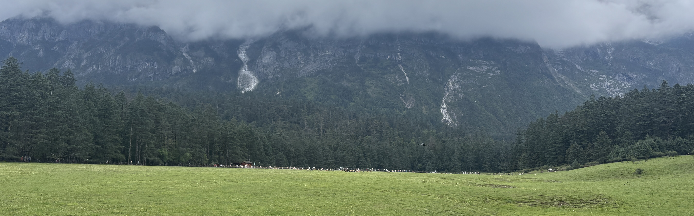

# 👋 Hi, here is Delson

🎓 I am a **1st-year PhD student** at the **Clover Lab**, **The Chinese University of Hong Kong (CUHK)**.

🌱 My research interests revolve around:
- **Contact-rich manipulation** 🤖
- **Embodied intelligence** 🧠
- **Generative imitation learning** ✨

🌟 I am passionate about exploring the intersection of robotics, machine learning, and control theory to enable advanced manipulation capabilities.

---

## 📫 How to Reach Me
- **Email**: 1155252147@link.cuhk.edu.hk
Feel free to connect with me or check out my work!

<!--
**Delson-1999/Delson-1999** is a ✨ _special_ ✨ repository because its `README.md` (this file) appears on your GitHub profile.

Here are some ideas to get you started:

- 🔭 I’m currently working on ...
- 🌱 I’m currently learning ...
- 👯 I’m looking to collaborate on ...
- 🤔 I’m looking for help with ...
- 💬 Ask me about ...
- 📫 How to reach me: ...
- 😄 Pronouns: ...
- ⚡ Fun fact: ...
-->
